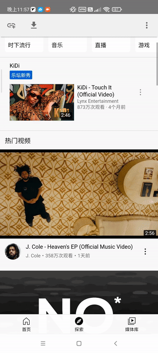
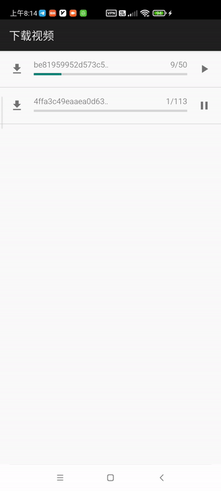

# 视频浏览器

一个解析视频地址的浏览器

**视频保存目录**：

- m3u8：*Android/data/euphoria.psycho.explorer/files/Download*
- 其他格式：*Download*

## 下载

* [示例](https://github.com/grandiloquent/VideoBrowser/releases)
* [国内](https://lucidu.cn/article/jqdkgl)

## 支持的视频网站

* [x] 快手
* [x] 抖音
* [x] TikTok
* [x] [AcFun弹幕视频网](https://www.acfun.cn/)
* [x] [爱奇艺](https://m.iqiyi.com/)
* [x] [B站](https://www.bilibili.com/)
* [x] [芒果TV](https://mgtv.com/)
* [ ] [腾讯视频](https://v.qq.com/)
* [x] [Twitter](https://m.twitter.com)
* [x] [YouTube](https://m.youtube.com)
* [x] [91porn](https://91porn.com/index.php): 批量下载视频
* [x] [XVideos](https://xvideos.com)
* [x] [PornHub](https://www.pornhub.com)
* [x] [PornOne](https://pornone.com/)
* [x] http://57ck.cc/
* [x] https://hxz315/videos/

## 引用

* https://github.com/HaarigerHarald/android-youtubeExtractor
* https://github.com/soarcn/BottomSheet
* https://github.com/google/volley

## How to download TikTok videos?

1. Copy the video shared link or page address from the tiktok application or website, some like:

        https://vm.tiktok.com/ZSJkHUCwK/
        https://www.tiktok.com/@travelscenerykj/video/6990367736601922822

2. Click the add link button in the upper left corner

3. Paste the video shared link or page address into the input,then click the ok button.

## 问题

* 如果某些页面的视频无法下载，请点击顶部工具栏的刷新按钮刷新页面